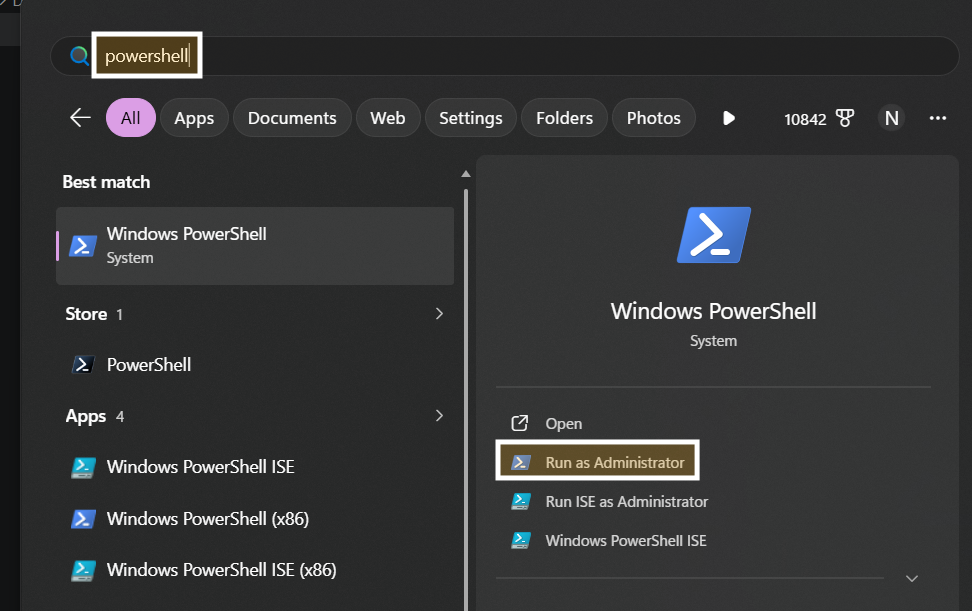

# Python to EXE (Windows) — Ultra-Detailed Beginner Guide

This guide walks you through creating a Windows EXE from a Python app using PyInstaller. It is written for beginners and includes detailed steps, expected results, and troubleshooting. It covers both folder-based EXE (recommended for installers) and single-file EXE.

## When to Use This Format

Use the EXE format when you just need a runnable file — no installer, no Start Menu entry, no uninstaller. It is the simplest distribution method and the required first step for both MSI and MSIX packaging.

## Time Estimate

~15 minutes for a first build (longer if you need to troubleshoot missing dependencies).

> **ARM64 note:** This guide produces x86_64 EXEs only. To target ARM64 Windows (increasingly common on Surface devices and Copilot+ PCs), you must run PyInstaller on an ARM64 Windows machine — PyInstaller cannot cross-compile between architectures. GitHub Actions provides `windows-11-arm` hosted runners for this purpose.

## Related Guides (Packaging Order)

- Start here for all Windows packaging
- Next step for MSI: See [python-to-msi.md](python-to-msi.md)
- Optional next step for MSIX: See [python-to-msix.md](python-to-msix.md)

## Purpose

This guide shows how to turn a Python app into a Windows EXE using PyInstaller, with repeatable steps, versioned output, and clear troubleshooting.

## Who Benefits

- Developers distributing Windows desktop apps
- Teams that need consistent, repeatable EXE builds

## What You Will Build

- A Windows EXE that runs your Python app without needing Python installed
- Optionally, a single-file EXE for easy sharing

## Who This Is For

- Beginners packaging their first Python app for Windows
- Teams that want a repeatable, readable build process

## Concepts (Quick)

- EXE: Windows executable file
- PyInstaller: tool that bundles Python + your code into an EXE
- Spec file: a build recipe PyInstaller uses
- `dist/`: output folder for final artifacts
- `build/`: intermediate build files (safe to delete)

## Prerequisites

- Windows 10/11
- Python 3.10 or newer installed
- Your app runs locally with `python main.py`
- A terminal (PowerShell)

### Optional (Recommended)

- Git (for versioned builds)
- Windows SDK (for `signtool`)

## Recommended Project Layout

```text
project/
  main.py
  src/
  data/
  requirements.txt
  packaging/
    app.ico
    version_info.txt
```

## Step 1: Open a terminal in your project folder

Open PowerShell and `cd` into your project folder.

Expected result: `Get-Location` shows your project folder.



## Step 2: Create and activate a virtual environment

<!-- Creates an isolated Python environment and activates it for this session -->
```powershell
python -m venv .venv
.\.venv\Scripts\Activate.ps1
```

Expected result: your prompt starts with `(.venv)`.


## Step 3: Install dependencies and PyInstaller

<!-- Installs your app's dependencies and the PyInstaller build tool -->
```powershell
pip install -r requirements.txt
pip install pyinstaller
```

Expected result: PyInstaller installs without errors.

If you want reproducible installs, pin dependencies:

<!-- Pins all dependency versions to a lock file for consistent builds -->
```powershell
pip install pip-tools
pip-compile --generate-hashes -o requirements.lock
pip-sync requirements.lock
```

## Step 4: Create a spec file (recommended)

The spec file is a build recipe you can edit later.

<!-- Generates a MyApp.spec file that controls how PyInstaller builds your app -->
```powershell
pyinstaller --name MyApp --specpath . --noconfirm .\main.py
```

Expected result: `MyApp.spec` appears in your project folder.


> **Note:** Spec files are version-specific. If you see an error like `unexpected keyword argument 'optimize'`, regenerate the spec with your installed PyInstaller or remove the unsupported field.

## Step 5: Edit the spec file for data files and imports

Open `MyApp.spec` and update these fields if needed:

```python
datas=[('data', 'data')]
hiddenimports=['pkgutil', 'importlib']
```

Explanation:

- `datas` bundles non-code files like images or JSON
- `hiddenimports` fixes modules that PyInstaller misses

Example with an `images` folder:

```python
datas=[('images', 'images')]
```

## Step 6: Build a folder-based EXE (recommended for MSI)

<!-- Builds the EXE into a dist\MyApp folder using the spec file -->
```powershell
pyinstaller MyApp.spec --noconfirm
```

Expected output (two common layouts):

- Layout A (newer PyInstaller):
  - `dist\MyApp\MyApp.exe`
  - `dist\MyApp\_internal\` folder
- Layout B (older PyInstaller):
  - `dist\MyApp\MyApp.exe`
  - dependency files next to the EXE (for example, `python38.dll`, `.pyd` files)


## Step 7: Build a single-file EXE (optional)

If you want one file, run:

<!-- Packages the entire app into a single standalone EXE file -->
```powershell
pyinstaller --onefile --name MyApp .\main.py
```

Expected output:

- `dist\MyApp.exe`

## Step 8: Add icon and version info (optional but recommended)

Add this to your spec file in the `EXE` section:

```python
exe = EXE(
    ...,
    icon='packaging\\app.ico',
    version='packaging\\version_info.txt',
)
```

Expected result: your EXE shows a custom icon and version in Properties.

## Step 9: Test the EXE on a clean machine

- Copy the EXE to a clean VM or another PC
- Run it and test key features
- Verify bundled files load correctly


## Step 10: Sign the EXE (production requirement)

> **EV certificate requirement:** Windows SmartScreen builds reputation based on your signing certificate. A standard OV (Organization Validation) certificate will sign the file successfully, but SmartScreen may still show a warning until the EXE accumulates sufficient download history. An EV (Extended Validation) certificate grants immediate SmartScreen reputation and is the recommended choice for production distribution. EV certificates are available from DigiCert, Sectigo, and other trusted CAs.

For a folder-based build, sign the EXE inside the `dist\MyApp\` folder:

<!-- Signs the EXE with a trusted certificate so Windows does not block it -->
```powershell
signtool sign /fd SHA256 /tr http://timestamp.digicert.com /td SHA256 dist\MyApp\MyApp.exe
```

> **Note:** If you built a single-file EXE (Step 7), the path is `dist\MyApp.exe` instead.

Expected result: EXE properties show a valid digital signature.

## Step 11: Verify version and signature

1. Right-click the EXE and open Properties.
2. Check the Details tab for version info.
3. Check the Digital Signatures tab for a valid signature.

## CI/CD with GitHub Actions

Automate EXE builds so every push to `main` produces a fresh artifact and every version tag produces a signed EXE ready to distribute.

Create `.github/workflows/build-exe.yml` with this content:

```yaml
name: Build Windows EXE

on:
  push:
    branches: [main]
    tags: ["v*.*.*"]
  pull_request:
    branches: [main]

jobs:
  build-exe:
    runs-on: windows-latest

    steps:
      - name: Checkout code
        uses: actions/checkout@v4

      - name: Set up Python
        uses: actions/setup-python@v5
        with:
          python-version: "3.12"

      - name: Install dependencies and PyInstaller
        shell: bash
        run: |
          pip install -r requirements.txt
          pip install pyinstaller

      - name: Extract version from git tag
        id: version
        shell: bash
        run: |
          # Strip leading "v" from the tag name; fall back to 0.0.0-dev on branches
          if [[ "${GITHUB_REF}" == refs/tags/v* ]]; then
            echo "VERSION=${GITHUB_REF_NAME#v}" >> "$GITHUB_OUTPUT"
          else
            echo "VERSION=0.0.0-dev" >> "$GITHUB_OUTPUT"
          fi

      - name: Build EXE with PyInstaller
        shell: bash
        run: |
          pyinstaller MyApp.spec --noconfirm

      - name: Sign EXE (tag pushes only)
        if: startsWith(github.ref, 'refs/tags/')
        shell: bash
        env:
          CERTIFICATE_BASE64: ${{ secrets.WINDOWS_CERTIFICATE_BASE64 }}
          CERTIFICATE_PASSWORD: ${{ secrets.WINDOWS_CERTIFICATE_PASSWORD }}
        run: |
          # Decode the base64-encoded PFX certificate stored in GitHub Secrets
          echo "$CERTIFICATE_BASE64" | base64 --decode > certificate.pfx
          signtool sign /fd SHA256 /f certificate.pfx /p "$CERTIFICATE_PASSWORD" \
            /tr http://timestamp.digicert.com /td SHA256 \
            dist/MyApp/MyApp.exe
          # Remove the decoded certificate from disk immediately after signing
          rm certificate.pfx

      - name: Upload EXE artifact
        uses: actions/upload-artifact@v4
        with:
          name: MyApp-exe-${{ github.ref_name }}
          path: dist/MyApp/
          retention-days: 30
```

### Setting Up Signing Secrets

Add these two secrets to your GitHub repository under Settings → Secrets and variables → Actions:

| Secret name | Value |
|---|---|
| `WINDOWS_CERTIFICATE_BASE64` | Your `.pfx` file encoded as base64 |
| `WINDOWS_CERTIFICATE_PASSWORD` | The password for the `.pfx` file |

Encode your certificate file on Linux or macOS:

```bash
base64 -w 0 my-certificate.pfx | xclip -selection clipboard
```

On macOS:

```bash
base64 -i my-certificate.pfx | pbcopy
```

> **Note:** Signing runs only on tag pushes (`v*.*.*`). Builds on `main` and pull requests produce unsigned artifacts, which is normal for development builds.

## Common Issues and Fixes

- EXE crashes on start: add missing modules to `hiddenimports`
- Data file missing: add to `datas` and use correct relative paths
- Antivirus warning: avoid UPX and sign the EXE
- `MyApp.spec` errors: regenerate spec with your installed PyInstaller

## Final Checklist

- App runs with `python main.py`
- EXE runs on a clean machine
- All data files are bundled
- EXE is signed and versioned
- Build steps are repeatable
- GitHub Actions workflow committed to `.github/workflows/`
- Required secrets added to GitHub repository settings
- Build passes end-to-end on a tag push
- Signed artifact downloaded from Actions and tested on a clean machine
- Screenshot placeholders replaced with real screenshots in `images/windows/`
